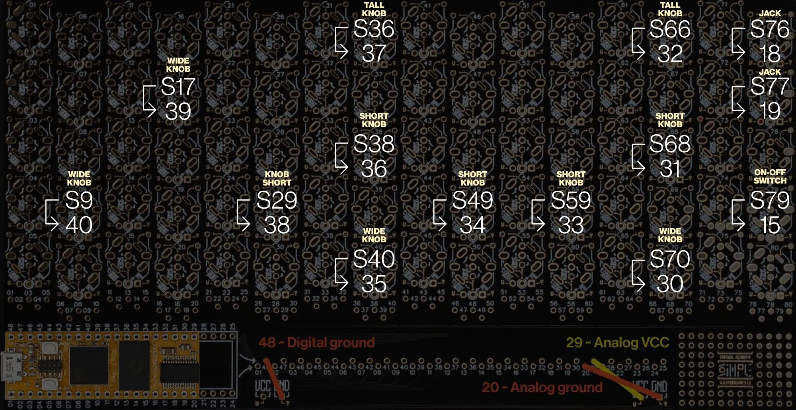
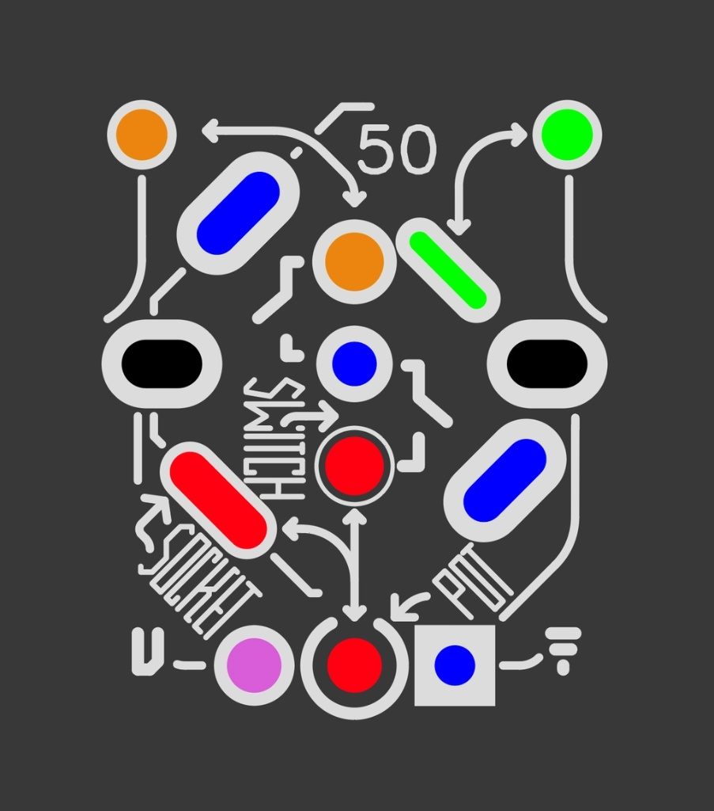
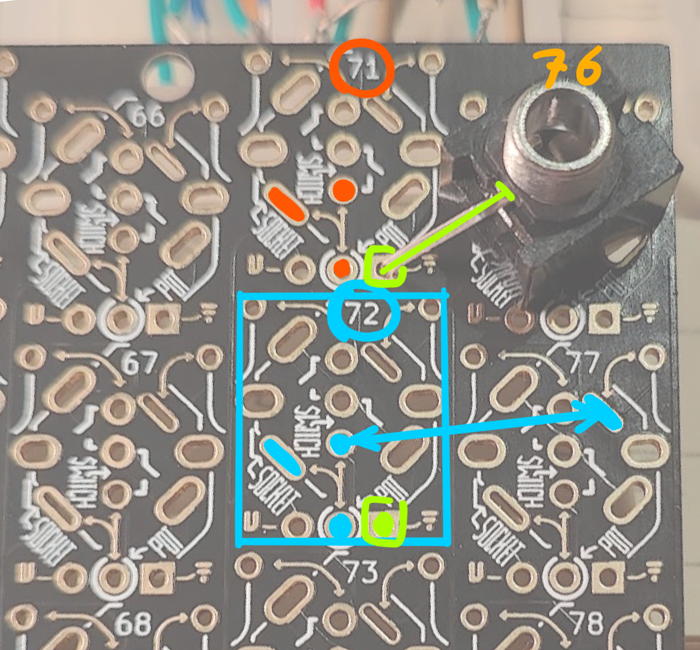
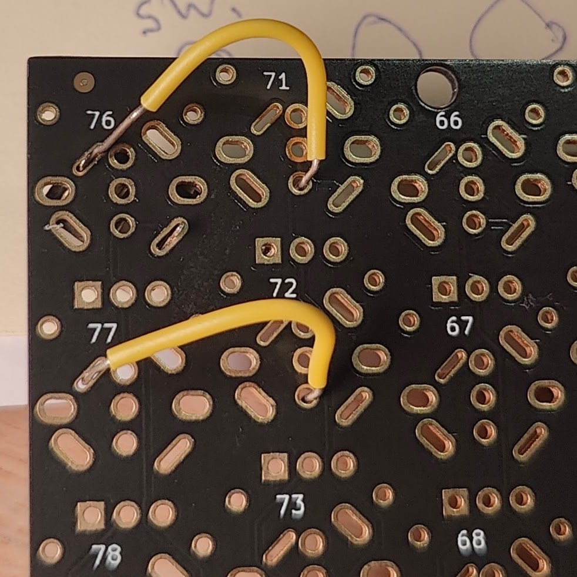
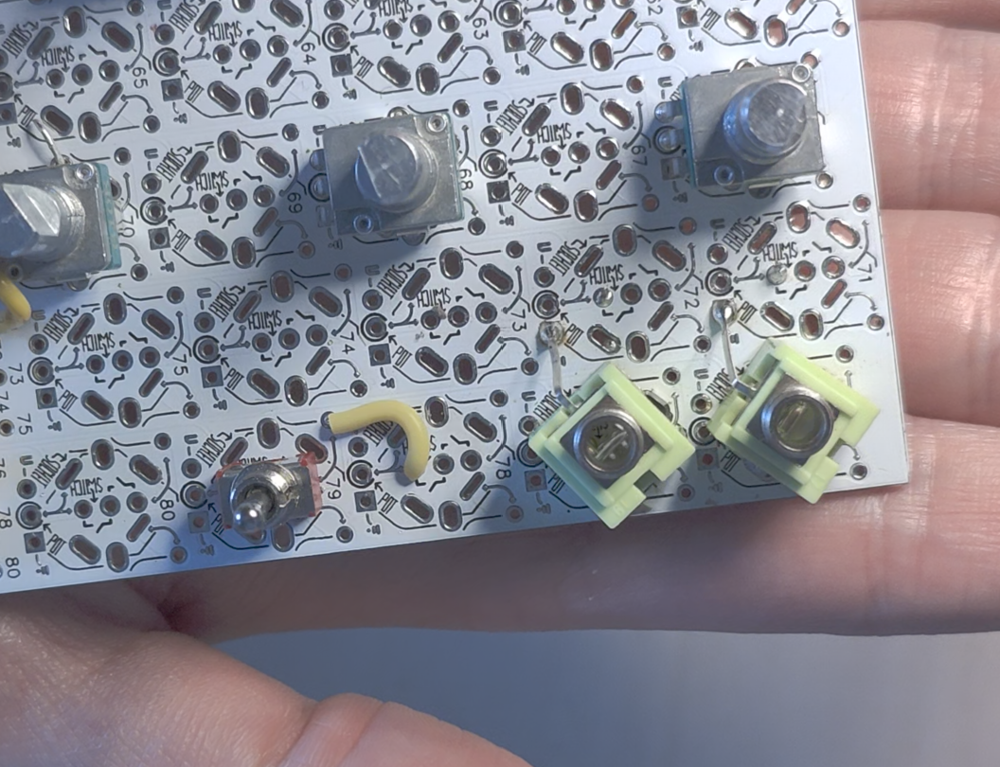

# Feedback Gardenscpr - for Synthux Audrey II
## Custom top plate and knobs built on top of the Synthux Designer Simple kit

♻️🌲This Feedback Gardenscape is not made by Synthux, but is a diy cosmetic alternative by me jonwtr.

Link to official Synthux page about Audrey ii: https://www.synthux.academy/audrey-ii

### Intro / about
As Audrey is built on top of the Synthux Designer Simple kit, and I had a spare one, I made my own interpretation upon Roey's design using some elements I've been experimenting with: custom 3D printed knobs, lasercutting, landscape elements.
I'm using a design reminiscent of crop circles, of which I thought when hearing the mysterious horrorscape sounds.

### 3D printed parts:
- knobs become trees:
    - I made 3 sizes following the original design
    - printed with a Bambulab 0.2 mm nozzle, high quality setting 2 support layers and auto support.
    - made a few versions since first upload: last added files use no support and print just fine with a 0.4mm nozzle imo.
    - The slightly different sizes because i've found that different filaments and different settings do have an influence on the precise size. 
    - The trick is to find a size / setting that makes a tight fit, while still allowing to remove.
    - **Files to print:** the ones ending in `_5D` (e.g. `tree_small_5D.stl`, `tree_medium_39_5D.stl`, `tree_large_4_5D.stl`). These are the ones in the Bambu Studio project [tree_Dshaft_tapered.3mf](3Dfiles/tree_Dshaft_tapered.3mf).
    - `tree_small_round6mmSK.stl` is a test for the bare 6 mm plastic shafts; it is still too loose (see Todo).
    - the D shaft is slightly tapered to ensure a strong fit
    - Though all trees are the same model I slightly gave each one a different rotation to ensure a bit of randomness.
- reset / boot buttons
    - a standard and a longer version: the longer one is for a Daisy mounted lower, without the kit headers (see [Lasercut files](#lasercut-files))

### Faceplate
It is made of two layers of laser cut wood glued together, to make them align perfectly I use the standoffs.
- Grass top layer:
    - this layer has a finish with miniature grass (from e.g. train models)
    - glued on before cutting (woodglue).
    - 2 mm holes for bolts to fit in the hex standoffs.
- The bottom layer of the top plate:
    - cutouts to fit the pots
    - hex cutouts fitting the standoffs
    - mounted on the pots without washers in between;
    - the Daisy top pins are slightly too high therefore there's a cutout to accommodate this.
- 2 holes in both plates to allow two 3d printed T shaped button inserts for reset / boot knobs of the Daisy (they are only held in place by fitting in between)

### Box / case:
As my design is slightly bigger I'm also making this a custom size compared to the original one. Slightly taller and wider.
- Made with [makercase](https://www.makercase.com/#/basicbox) 
- the design and exported svg's are using a 0.12 mm kerf setting:
    - Your laser may need different settings;
    - keep in mind that I added extra holes in the bottom plate for the hexnut bolts;
    - and a hole to fit the usb cable (it goes slightly inside the box)

### The SVG was made in Adobe Illustrator
I used one of the available design assets to position everything.
- There are three important layers groups
    - top layer grass
    - top layer bottom
    - box / case (this is the makercase 0.12mm kerf version)
- When importing SVG from illustrator into e.g. Lightburn you might need to adjust the dpi import settings

### Lasercut files
Use the files in [lasercutlayers](lasercutlayers). They contain the options for both Daisy versions and both mounting heights.

> ⚠️ **Inspect the files closely before cutting.** Each file contains more than one option, so you need to delete the parts you don't need first.

| File | What's in it |
| :--- | :--- |
| [box_0.12kerf_usb-hole-both-heights.svg](lasercutlayers/box_0.12kerf_usb-hole-both-heights.svg) | The box, 1 mm lower than the first version. The side panel has **two USB holes drawn on top of each other**: one for a Daisy on the kit headers, one for a Daisy mounted lower without them. Delete the one you don't need. |
| [topplate_grass_2mm_left-Seed_right-Seed3.svg](lasercutlayers/topplate_grass_2mm_left-Seed_right-Seed3.svg) | Top layer of the top plate, the one with the grass. |
| [topplate_bottom_3mm_left-Seed_right-Seed3.svg](lasercutlayers/topplate_bottom_3mm_left-Seed_right-Seed3.svg) | Bottom layer of the top plate, glued underneath the grass layer. |

The LightBurn projects (`FeedbackGardenscprV2.lbrn2`, `FeedbackGardenscprV3.lbrn2`) contain all the drawings, including older versions. If you use them, check carefully which parts you select.

In both top plate files the **left** drawing is for the original Daisy Seed and the **right** drawing is for the Daisy Seed 3. On the Seed 3 the reset / boot buttons sit in a slightly different place, so the button holes are moved to match.

A Daisy mounted lower (without the kit headers) sits further from the top plate, so it needs the longer reset / boot buttons:
- [bootresetbutton_standard_with-kit-headers.stl](3Dfiles/bootresetbutton_standard_with-kit-headers.stl): Daisy mounted on the kit headers
- [bootresetbutton_long_without-kit-headers.stl](3Dfiles/bootresetbutton_long_without-kit-headers.stl): Daisy mounted lower, without the kit headers
- [bootresetbutton_standard+long_0.2mm-nozzle.3mf](3Dfiles/bootresetbutton_standard+long_0.2mm-nozzle.3mf): Bambu Studio project with both

*Top left: original box. Top middle: the current box, 1 mm lower, with both USB holes. Bottom left: top plates for the original Daisy Seed. Bottom right: top plates for the Daisy Seed 3.*

### Other remarks
I've already foreseen the addition of a three-way on/off/on for when in the future this might be a handy extra for custom firmware. It's connected to an extra digital pin, ignored by the official code.
There is already code implemented for audio in, I did not foresee this, though it could be added later, but this would need another design, as the top right is already 'full'.

Todo
- Planning a making off-ish video on YouTube
- More tree knob versions:
    - for pots with rounded tops
    - for pots with a 6 mm plastic shaft (normally used bare, e.g. on the Simple Touch)

--

# Audio I/O Mod: Upgrading to Stereo TRS

The Audrey II firmware natively supports audio input. By default, the hardware uses two mono TS jacks for output, so there's no audio input. Upgrading these to stereo TRS jacks gives you a dedicated stereo output and a dedicated stereo input on the same footprint. 

This guide applies to any Audrey build, including the white Designer PCB kits. 
*For standard assembly reference, see the [Original Audrey II Assembly Tutorial](https://tsemah.notion.site/Audrey-II-Assembly-Tutorial-1736331933b8809f8412f94f634622a5).*

> **In short:** the full guide below makes this look harder than it is.
>
> 1. Remove the two mono jacks.
> 2. Fit two Thonkiconn TRS jacks in their place.
> 3. Ground each jack: bend its long outer pin (Sleeve) onto the GND pad to its left and solder it.
> 4. Bridge each jack's extra Ring pad to the unused slot next to it: 76 → 71 (out), 77 → 72 (in).
> 5. Move the yellow wire from 77 → 19 to 71 → 19. The 76 → 18 wire stays as it is.
> 6. Add two new wires for audio in: 77 → 16 and 72 → 17.

## Required Components
* 2x Green Thonkiconn Stereo 3.5mm Audio Jacks (PJ366ST)
* These TRS (Tip, Ring, Sleeve) jacks provide Left (Tip), Right (Ring), and Ground (Sleeve) connections. We will refer to the Left and Right connections as the "data" pins.

## Desoldering the Original Jacks
*Caution:* Removing multi-pin components can easily tear the PCB pads if forced. 
* The safest approach is to destructively remove the original mono jacks. Cut the plastic body of the part away from the top first.
* This leaves only the individual metal pins in the board, which can then be heated and removed one by one.
* Adding a small amount of fresh solder to the joint before heating can help the old solder flow and make extraction easier.
* *Helpful Soldering Tip:* Check out this [YouTube short on desoldering multi-pin components](https://youtube.com/shorts/9etvLoYCR0s?si=BeJnzQQqtzvRKzHb) before starting.

## The Matrix Routing Strategy

The Designer PCB routes components via a specific numbering scheme: the component's footprint slot (e.g., slot 77) connects to the corresponding pin number at the bottom of that column (e.g., pin 77), which is then wired to a microcontroller pin (e.g., Synthux pin 18 for audio out). Note that these Synthux pins map internally to the actual Daisy Seed pins.

Because a standard matrix slot only features one primary data access point, installing a stereo jack leaves the second channel disconnected. The PCB footprint features an isolated pad to solve this. To route the second channel, we bridge this isolated pad to the data pin of an adjacent, unused slot.

## Wiring and Installation Reference

Here is the final routing configuration to successfully implement the stereo swap mapping the Matrix slots to the correct Synthux pins:

Watch out: the pin numbers printed next to the microcontroller only match the Daisy Seed pins on one side (the first 20 pins). Luckily, audio in/out (16/17 and 18/19) are on the side that matches.

For an overview of the pins you could refer to my [evergrowing table spreadsheet](https://docs.google.com/spreadsheets/d/1xtg_s1tk8tm-6qNkBLFc6V1L_Mpmu-PCOvv7qEyr9mU/edit?usp=sharing). 

| I/O Type | Matrix Slot / Jack Pin | Signal Path | Synthux Pin |
| :--- | :--- | :--- | :--- |
| **OUT** (Stereo) | 76 (Tip) | Left Out | 18 |
| **OUT** (Stereo) | 71 (Ring) | Right Out | 19 |
| **OUT** (Stereo) | Jack Sleeve | Ground | - |
| **IN** (Stereo) | 77 (Tip) | Left In | 16 |
| **IN** (Stereo) | 72 (Ring) | Right In | 17 |
| **IN** (Stereo) | Jack Sleeve | Ground | - |

*(Note: On the output, this replaces the original yellow wire that previously went from matrix 77 to 19).*

## Bridging & Grounding Tips

### 1. Bridging the Ring Signal (Adjacent Pins)

You can easily create the required connections between the isolated pad and the adjacent slot. Bridge the right channel (Ring) to the adjacent slot:
* **Output:** Bridge the Ring pad at 76 to slot 71
* **Input:** Bridge the Ring pad at 77 to slot 72

This is best done using small jumper wires on the back of the PCB:

### 2. Ground Connection Mod

To save on extra wiring, you can bend the ground (Sleeve) pin of the TRS jack so it touches the adjacent ground pad on the PCB and solder them directly together.